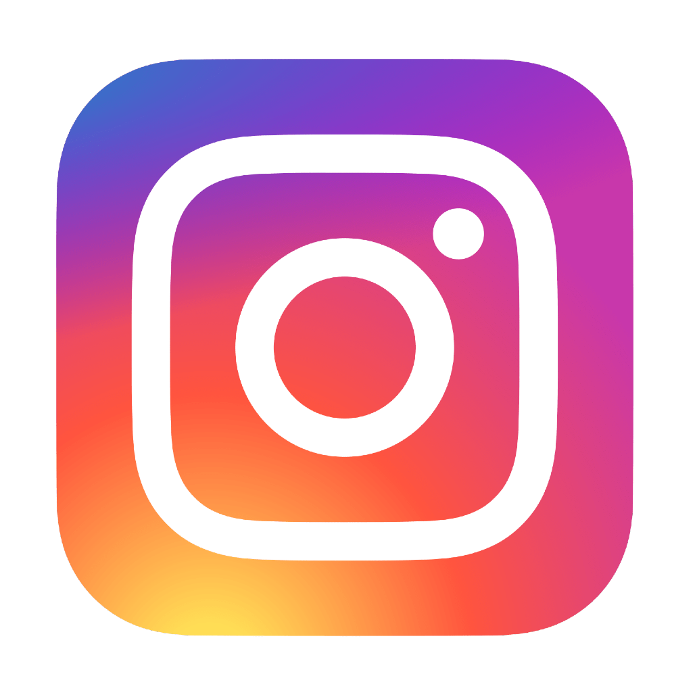
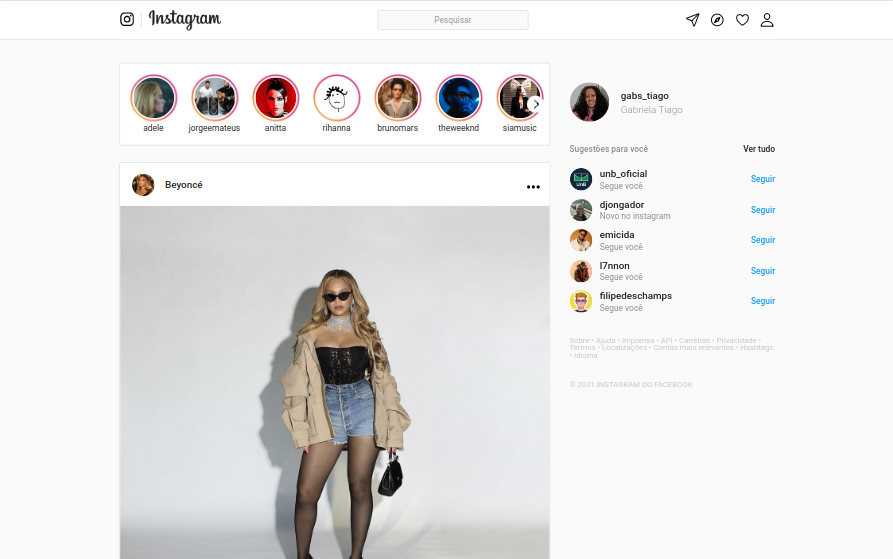
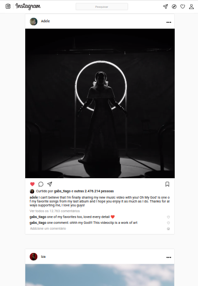
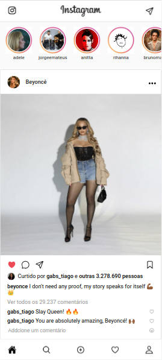
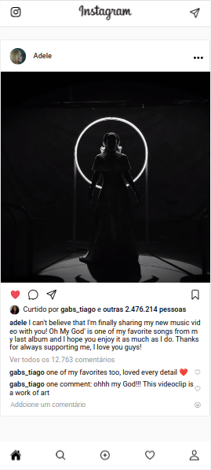
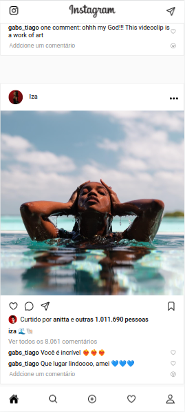
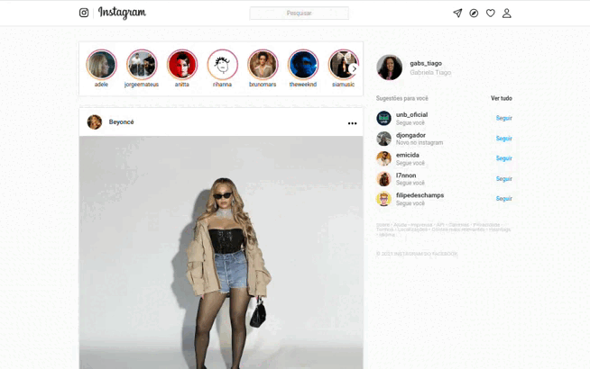

# 
Instagram

### 
Inspiração da rede social Instagram

   
   
   

## :clipboard: Descrição

Este projeto é um clone da rede social [Instagram](https://www.instagram.com), simplificado, desenvolvido com HTML e CSS. Ele permite visualizar os posts no feed disponíveis na timeline do usuário, com uma interface semelhante à do site original.

#️⃣ [**Acesse aqui**](https://gabrielatiago.github.io/Instagram/)

## :computer: Telas

### Desktop

### Tablet

### Mobile

## 🎮 Usando

## :books: Lições Aprendidas

- Tags semânticas HTML
- Hierarquia de css
- Flex-box
- Posições fixas
- Tag de vídeo
- Media screen
- Design responsivo

## :bulb: Reconhecimentos

- [Badges para Github](https://github.com/alexandresanlim/Badges4-README.md-Profile#-database-)
- [Inspiração de README](https://gist.github.com/luanalessa/7f98467a5ed62d00dcbde67d4556a1e4#file-readme-md)
- [Driven Education](https://www.driven.com.br)

## :muscle: Contribuição

Contribuições são bem-vindas! Se você encontrar algum problema ou tiver sugestões de melhoria, abra uma *issue* ou envie um *pull request*.

## :woman_technologist: Autora

Gabriela Tiago de Araújo

- email: <gabrielatiagodearaujo@outlook.com>
- linkedin: <https://www.linkedin.com/in/gabrielatiago/>
- portfolio: <https://gabrielatiago.vercel.app>

$~$

[🔝 De volta ao topo](#instagram)
